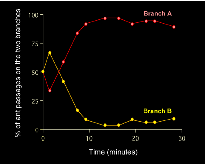
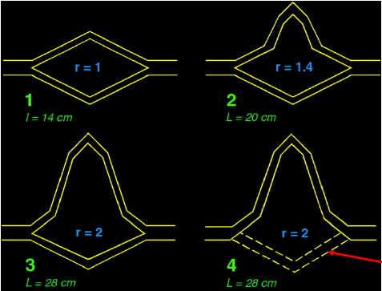
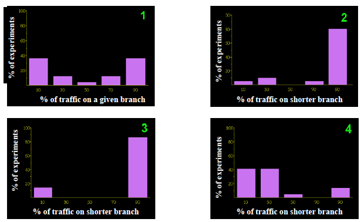

# Distributed Intelligent Systems

## Lesson 1  : Intro

### Definitions

* Swarm intelligence : some natural collective phenomena imply a close interconnection between individuals.
  * _Limited local information_ : Each individual in the group **has access only to limited local information and has no global knowledge of the structure **which it is engaged in constructing together with the other members of the group
  * _A set of simple individual rules_ : Each individual obeys **a collection of a few simple behavioural rules**. This rule set permits the group collectively to coordinate its activities and to build a global structure or configuration.
  * _The global structures which emerge accomplish some function_ : These structures often allow the group to solve problems. They are **flexible**(adapting easily to a novel environment), and they are **robust**, (if one or several individuals fail in their behaviour or make a simple mistake, the structures spontaneously re-form)
* Swarm intelligence definitions :
  * Cellular automata [^1] with decentralized control, lack of synchronicity, simple and quasi identical members
  * Any attempt to design algorithms or distributed solving devices inspired by the collective behavior of social insects and other animal societies [^2]
  * Intelligent swarm = group of non intelligent machines capable of universal computation [^3]

### Key mechanisms

1. **Self-organization**

   A set of dynamical mechanisms whereby structure appears **at the global level **as the result of **interactions among lower-level component**.

   Rules executed by the system's units on the basis of **purely local information**, without reference to the global pattern, which is an **emergent property of the system** rather than a property imposed upon the system by an external ordering influence.

2. **Stigmergy**

   "The worker does not direct his work, but is guided by it" [^4]. The coordination of tasks depends on the constructions and not the workers themselves. It defines a class of mechanisms exploited by social insects to coordinate and control their activity via **indirect interactions**.


### Characteristics

* Multistability : coexistence of several stable states for the system
* Creation of spatio temporal structures
* Existence of bifurcations when some parameters change (e.g. parameters influencing stability)

### Key ingredients 

* Multiple interactions
* Randomness
* Positive feedback (e.g. recruitment, reinforcement)
* Negative feedback (e.g. limited nb of foragers, pheromone evaporation)


### Foraging strategies in ants

* **Individual** : Not all are collective nor based on stigmergy e.g. *Desert ant* with individual foraging strategy. Uses internal compass, dead-reckoning (path integration), local search, yet achieves very accurate navigation.
* **Tandem** : Antennal contact for recruitement based on food chemical signatures on the body
* **Group recruitment** : Leader recruits workers
* **Mass recruitment** : Chemical trail. Shows a growing phase (positive feedback) then saturation (negative feedback)

### Role of randomness 

Stochastic individual behavior combined with the amplification of information can lead to collective decisions. 

The probability of losing the trail is :

* different depending on the species
* proportional to the length of the trail
* depends on the chemical concentration 

This shows a balance between **exploration** and **exploitation**. Need to sacrifice some accuracy for robustness in environment exploration.

### Bridge experiments : Selecting the shortest path

#### Suspended symmetric bridge



Microscopic model is a probabilistic choice of an agent at the bridge's bifurcation points [^5] :

$$ P_A = \frac{(k+A_i)^n}{(k+A_i)^n+(k+B_i)^n}=1-P_B \tag{1} $$

where : 

* $P_A$ / $P_B$ : probability for the ant i+1 to pick up the branch A or B
* $x_i$ : nb of ants having chosen $x$
* $n$ : degree of non-linearity (model param) $\iff$ exploitation
* $k$ : degree of attraction of an unmarked branch (model param)  $\iff$ exploration

Can add some noise / randomness by setting :

$$ A_{i+1} = A_i + 1 \text{ if } \delta \leqslant P_A  \text{ with } \delta \sim \mathcal{N}(\mu,\,\sigma^{2}) \in [0,1] \tag{2}$$

#### Suspended asymmetric bridge

Two branches differ in length by a ratio $r$ .





Adaptation depends on the species used for $4$ . Some get stuck on the longer branch (like in figure above) but other are able to find a shorter path because they integrate other functionnalities / infos (e.g. dead-reckoning which gives distance, polarity information which gives the geometry of trails).

### Foraging in free space

Again depends on the mecanism used. Some ants  (e.g. exclusively pheromone based) get stuck at the first food source they find no matter the richness of the source. 

### Ant networks

The fundamental ecological unit is the **colony**. The can also organise in larger structures (super-colonies). They are able to optimize the internest connections : they find the **minimal spanning tree** connecting all the nests.

## Multi-Agent systems based on Ant trail Laying/Following mecanisms

### Motivation 

* **Ant Colony Optimization (ACO)** algorithms as an example of successful transportation of ideas from **natural** systems to **computational artificial** systems (software multi-agent systems)
* ACO algorithms as example of exploitation of swarm intelligenceprinciples as a particular form/instance of **distributed intelligence**.

### Travelling Salesman problem

* **Problem** Find the shortest path which allows the salesman to visit once and only once each city in the graph
* **Difficulty** NP-Hard.

### Ant System (AS) algorithm [^6]

* Ants are given a **memory** of visited nodes (solves self-reinforcing loops)
* Ants build solutions **probabilistically** without updating pheromone trails (forwards ants)
* Ants **deterministically backward** retrace the forward path to update pheromone (backwards ants)
* Ants deposit a **quantity of pheromone function of the quality of the solution they generated** 
* Pheromones evaporates much more quickly than in nature
* Assumption : fully connected graph

Pseudo - code

```
Loop /* time t = 1 */
	Place one ant on each node /* n nodes */
	for each ant /* build a tour */
    	for each node
    		apply transition rule /* find the next node to go to */
    Update pheromone trails
Until End_condition /* time t = t_end */
```

Explicity we have

* $J^k_i$ a list of nodes still to be visited by ant $k$ when it is at node $i$ . When the ant passes through $i$ it adds it to the taboo list / scratches it from $J^k_i$ (it should have to come back to it)
* $T$ a constructed tour, which is of length $n$ where $n$ is the number of nodes
* $t$ iteration index / time / nb of times the algorithm is run

**transition rule** During a tour $T$ the ant $k$ at the node $i$ decides to move to node $j$ with probability : 

$$ p_{ij}^k (t) = \begin{cases} 0, & \text{ if node $j$ has been visited by ant $k$ already }   \\  \frac{[\tau_{ij}(t)]^{\alpha}[\eta_{ij}]^{\beta}}{\sum_{I \in J_i^k}{[\tau_{iI}(t)]^\alpha [\eta_{iI}]^{\beta}} }, & \text{if the node has not been visited yet} \tag{3} \end{cases}$$

where :

* $\eta_{ij} = \frac{1}{d_{ij}}$ is the visibility (heuristic desirability of a node). static.
* $\tau_{ij}$ is the quantity of virtual pheromone deposited
* $\alpha$ controls the influence of the pheromone
* $\beta$ controls the influence of the local heuristic (visibility)

**pheromone update rule** at the end of each tour $T$, each ant $k$ deposits virtual pheromone on the link $(i,j)$ where it has visited :

$$ \Delta\tau_{ij}^k  = \begin{cases} 0, & \text{ when $(i,j)$ has not been used during $T$} \\ \frac{Q}{L^k(t)}, & \text{when $(i,j)$ has been used during $T$} \tag{4} \end{cases}$$

where  :

* $L_k(t)$ is the length of the tour done by ant $k$ at iteration $t$
* $Q$ is a heuristic parameter

The default update rule for TSP is 

$$ \tau_{ij}(t+1) \leftarrow (1-\rho) \tau_{ij}(t) + \Delta\tau_{ij}(t) \text{ with } \Delta\tau_{ij}(t) = \sum_{m=1}^k \Delta\tau_{ij}^k \tag{5}$$

where $\rho$ is an evaporation coefficient, and $\tau$ is initialised at $\tau_0$.


**Summary of AS** : Ants are launched at each iteration from each node to explore the network. They build their paths probabilisticallywith a probability function of: 

(i) **artificial pheromone values**, and

(ii) **heuristic values **(in TSP: city visibility)

They **memorize** visited nodes. Once reached their destination nodes (in TSP the last city on their list), they retrace their path backwards and update the pheoromone trails to encourage the other ants to take their path if it was a good one.

### Ant system with Elitism (EAS)

$$ \tau_{ij}(t+1) \leftarrow (1-\rho) \tau_{ij}(t) + \Delta\tau_{ij}(t) + e \Delta\tau^e_{ij}(t) \tag{6}$$

where $\Delta\tau^e_{ij}(t) = \frac{Q}{L^+}$ if $(i,j)$ belongs to the best tour (reinforcing best solution) 


### Conclusion

1. Differences between artificial and natural SI
2. Differences between computational and physical SI
3. Key mechanisms for natural SI: self-organization and stigmergy
4. Self-organization ingredients: positive feedback, negative feedback, randomness, multiple interactions
5. SI-based systems exploit careful balance between exploration and exploitation
6. Microscopic models help understanding SI-based systems
7. Ants exploit trail laying/following mecanims and other strategies for foraging
8. Ants are able to generate efficient inter-nest networks
9. Trail laying/following mechanisms can be expanded with other properties of the agent easily implementable in software (e.g., memory, modulation of the pheromone quantity, etc.)
10. Ant System has been the first metaheuristictaking advantage of the ant inspiration
11. The first NP hard problem it has been applied was the Traveling Salesman Problem

[^1]: Beni & Wang, 1989
[^2]: Bonabeau, Dorigo and Theraulaz, 1999
[^3]: Beni, 2004
[^4]: Grassé P. P., 1959
[^5]: Deneubourg, 1990
[^6]: Dorigo, Colorni, Maniezzo, 1991 