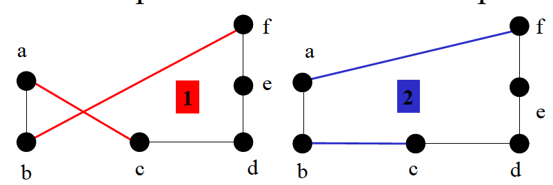

# Distributed Intelligent Systems

## Lesson 2  : Multi-Agent Systems based on Ant Trail Laying/Following Mechanisms *Algorithms and Applications*

### Ant Colony System (ACS) 

Offers an improved constructive heuristic [^1] with a different transition rule, pheromone update rule and the use of a candidate list for the choice of the next city.

Pseudo-code

```
Loop /* time t = 1 */
	Place one ant on each node /* n nodes */
	for each ant /* build a tour */
    	for each node
    		apply a construction rule /* build a route vs going to next node */
    Update pheromone trails /* Only done once the paths are built*/
Until End_condition /* time t = t_end */
```

Route construction rule : an ant $k$ on city $i$ choses the city $j$ to move to

$$ j = \begin{cases} argmax_{u \in J_i^k} \{ [\tau_{iu}(t)][\eta_{iu}]^{\beta} \}, & \text{if}\ q \leqslant q_0 \\      J, & \text{otherwise}    \end{cases} \tag{1} $$

where :

* $q$ $ \sim \mathcal{N}(\mu,\,\sigma^{2}) \in [0,1]$
* $q_0 \in [0,1]$ controlling exploration vs exploitation (in AS $q_0 < 0$)
* $J \in J^k_i$ a randomly selected rule from the prob. update rule eq (2).

This rules exploits the pheoromones up to now *and* the distance to the next city to chose its route. It can adapt between exploitation (a **deterministic** rule when $q\leqslant q_0$ which exploits the current knowledge of the system) and exploration (a **probabilistic** rule, roulette wheel like in AS). The city choice is still random according to :

$$ p^k_{iJ}(t) = \frac{[\tau_{iJ}(t)][\eta_{iJ}]^{\beta}}{\sum_{l \in J_i^k}{[\tau_{il}(t)] [\eta_{il}]^{\beta}} } \tag{2}$$

The pheromone traces are then updated only for the best tour $T+$ :

$$ \tau_{ij}(t+1) \leftarrow (1-\rho) \tau_{ij}(t) + \rho \Delta\tau_{ij}(t) \\  \text{ with } \Delta\tau_{ij}(t) =\frac{1}{L_+} \tag{3} $$

 The main difference is resumed in the following :

| Algorithm |                Behaviour                 |
| --------- | :--------------------------------------: |
| AS        | all ants can update the pheromone trails |
| EAS       | all ants can update the pheromone trails; extra for the best one |
| ACS       | global update performed *only by the ant that generated the best tour*. It is a best-so-far |

The result for ACS is a more greedy, directed search : ants are encouraged to search for the path in the vicinity of the best tour found so far.

Note that ACS also maintains a list of candidate cities that can be explored prerentially.

### ACS-3-Opt

This optimized version of ACS offers a local update strategy on top of the improved heuristic for any ant $k$ in city $i$, the pheromone concentration on edge $(i,j)$ us updated as follows.

$$ \tau_{ij}(t+1) \leftarrow (1-\xi) \tau_{ij}(t) + \xi \tau_0(t)  \tag{4} $$

where $\xi$ is a model parameter ($\xi = 0.1$ [^2]) and $\tau_0$ represents the initial pheromone quantity on all edges ($\tau_0 = \frac{1}{nL_{nn}}$ with $n$ the number of cities and $L_{nn}$ the length of the tour produced by NN heuristic only).

This means the pheromone quantity decreases each time an edge is visited (indirectly favoring exploration and avoiding stagnation).

The second main advantage of this version if the addition of a "permutation search" : **k-opt**. Given a tour, it deletes up to $k$ mutually disjoint edges. Each fragment is reassembled into one of $2k-2$ other possibilities for the edge connections, leaving no disjoint subtours. This allows for an exhaustive search over all candidate solutions (if we are close to a solution, one permutation can bring us closer than searching).



### Advantages and drawbacks of local search

* Local search is complementaryto ant pheromone mechanisms, so probability it achieves a major impact on a given problem is high
* The quality of the achieved solutionis in particular improved **but** the computational cost is increased 
* Local search lacks of good starting solutions on which it can perform combinatorial optimization; these solutions are provided by artificial ants using pheromone mechanisms
* Depending on targeted performance metrics (wished solution quality vs. and desired computational cost) an appropriate balance between local search and constructive heuristic has to be chosen

### TrailLaying/Following Mechanisms appliedto Communication Networks: Ant-Based Routing Algorithms

#### Ant Based Control (ABC) [^3]

Application to telephone networks (assumption : same level of traffic congestion between $d$ (destination) and $s$ (source) as between $s$ and $d$). $n$ is the neighbour node from $N$ total nodes. Node $i$ has neighbouring nodes $k_i$.

The routing table for node $i$ is defined by :

$$ R_i = [r^i_{n,d}(t)]_{k_i,N-1} \tag{5}$$

where $$r_{n,d}^i(t) = \begin{cases} \text{ants : probability of routing from $i$ to $n$ with origin $d$} \\ \text{calls : deterministic path (higher value for chosing route from $i$ to $n$)} \end{cases}$$

Note that the $\sum_n r^i_{n,d}(t) = 1$

Ants are launched from $s \rightarrow d$ where they die. The neighbour to the current node (the one the ant came from) $r$ is reinforced by $\delta r$ , while the current node's $r$ is decayed by $\frac{1}{\delta r}$  where $\delta r$ depends on the time spent in the network (older ants have less impact on the network). Noise (for exploration) and delay can be added as well.

#### AntNet [^4]

Ants are launched at regular instants, asynchronously from each node to randomly chosen destinations; modulation of ant rate as a function of traffic. They build their paths probabilistically with a probability function of: 

(i) **artificial pheromone values **(stored in the routing tables R), and

(ii) **heuristic values **(length of queues,stored in the trip vectors Γ)

Ants memorize visited nodes and elapsed times. Once reached their destination nodes, they retrace their paths backwards, and update the pheromone trails and trip vectors. In this algorithm the ants know the pheromone trail as a function of the neighbouring nodes and their destination as well : $\tau_{ijd}$ (this can be done thanks to the trip vectors). Additionally the visibility $\nu_{ij}$ depends on time !

|                  F-ants                  |                  B-ants                  |
| :--------------------------------------: | :--------------------------------------: |
| collect information about available paths and traffic load (build the $Γ$) | F-ants that have reached their destinations. They backpropagate to update the routing tables R and Γ |
|      Share queues with data packets      |         Use high priority queues         |


### Why do ant-based systems work ?

* **Time** : a shorter path receives pheromone quicker
* **Quality** : a shorter path receives more pheromone
* **Combinatorics** : shorter path receives pheromone more frequentlybecause it is likely to have a lower number of decision points


[^1]: Gambardella & Dorigo, 1996; Dorigo & Gambardella, 1997
[^2]: Bonabeau et al.
[^3]: Schoonderwoerd, Holland, et al., 1996
[^4]: DiCaro and Dorigo, 1998