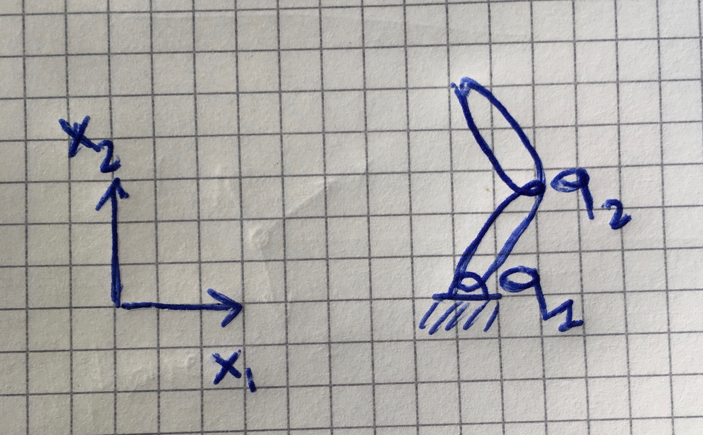
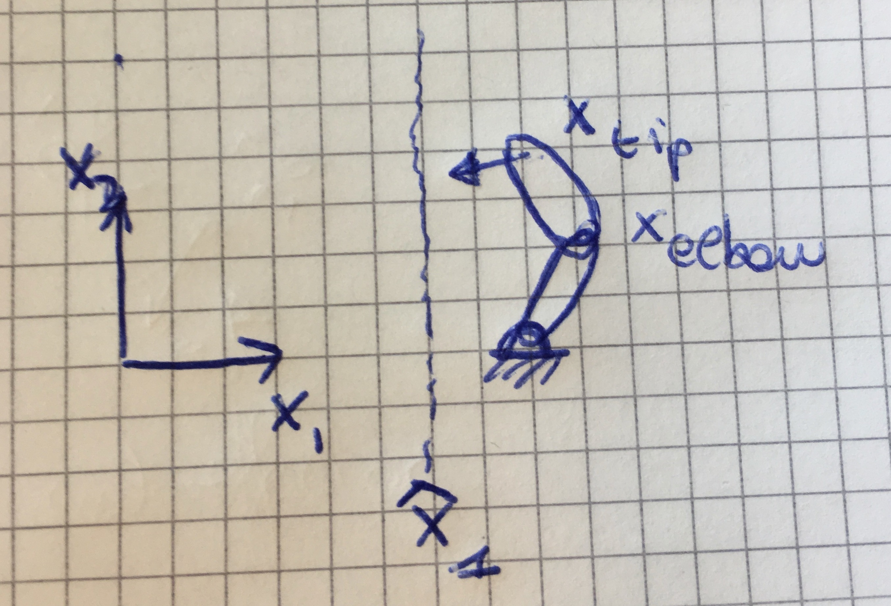

# Projet de semestre notes

## Project objective

> Controlling with partial jacobians : ability to assign positions to either one or both points of a robot arm.

## Init

jacobians are used to map the task-space (state $x$) to the joint-space (arm state $q$)

$$\dot{x} = J(q) \dot{} \dot{q}  \tag{1}$$

This gives a mapping from the state velocities to the joint velocities. We want the opposite : what are the desired velocities in joint-space for a given velocity in the task space : 

$$\hat{\dot{q}} = J^{+} \dot{x} \text{ where } \dot{x} = K_p(\hat{x}-x)  \tag{2}$$

where $\hat{x}$ is the desired position in the task-space.

$$ J = {\partial(x_1,\dots,x_n) \over \partial(q_1,\dots,q_n)} = \begin{bmatrix} {\partial q_1 \over \partial x_1} & {\partial q_2\over \partial x_1} & \dots \\   {\partial q_1 \over \partial x_2} & {\partial q_2\over \partial x_2} & \dots  \\ {\partial q_1 \over \partial x_3} & \dots & \dots  \end{bmatrix}  \tag{3}$$

## Single variable control

Notice that the first column of $J$ represents the independant control of the first variable of the joint-space (in this case $q_1$).

Conversely the first row represents the independant control of $x_1$ by moving $(q_1 \dots q_n)$. 

This means we can have independent control in either direction. Example : we want to give a command to $x_1$ but don't care about $x_2$, then we can use the partial jacobian represented by the first row.

Let's say we can control two parts of the robot arm : tip and elbow.

$$ \vec{x} = \begin{bmatrix} x_{tip} \\ x_{elbow} \end{bmatrix} = \begin{bmatrix} x_{tip}^1 \\ x_{tip}^2 \\ x_{elbow}^1 \\ x_{elbow}^2 \end{bmatrix} \tag{4}$$

We can write the Jacobian relationship :

$$ \dot{x} = J \dot{} \dot{q}  \text{  where  } x \in \mathbb{R}^4 , q \in \mathbb{R}^2, J \in \mathbb{R}^{4\times2} \tag{5}$$

and the inverse : 

$$   \dot{q} = J^+ \dot{x}   \text{  where  } J^+ \in \mathbb{R}^{2\times4} \tag{6} $$

In this case we can define the partial jacobians as follows : 

$$ J = \begin{bmatrix} J_{tip} \\ J_{elbow} & 0 \end{bmatrix} \tag{7}$$

## Application to project

### v1 : consider phone as a window

Tap two points on the phone, project them and consider them as objectives for the two "control" variables (e.g. $x_{elbow}$ and $x_{tip}$)

**Notes** This considers a linear projection to approximate the *visual servoing* problem. We can use Thalès to estimate a linear scale at a constant distance (e.g. `2m`).

### v2 : consider phone as a mobile window

In this case the mobile coordinates are not aligned with $(x_1; x_2)$ anymore, so we need be weary of the projection (since we consider the phone as a place we should be able to only rotate).

### v3 : consider that the robot can move around its base

This is called the "floating-base" or "free-base".

## TODO Project

* Implement this in `matlab`. 
  * window will have to be simulated (or scaled)
  * use `demoIK5.m`
* Implement in app (use the existing code for point selection)

